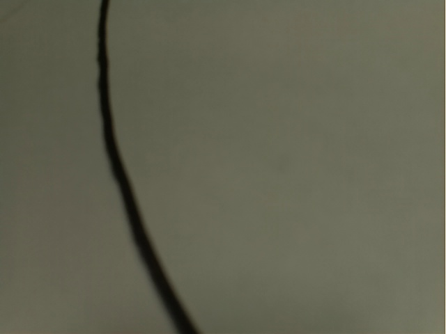
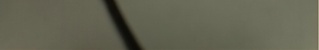
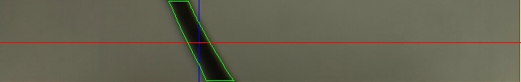

Suivi de ligne
==============

Ce tutorial présente l'implémentation d'un suivi de ligne pour le robot MRPiZ.

Matériel nécessaire
-------------------

* Un robot MRPiZ
* Une caméra compatible, idéalement grand angle, ce tutorial
  utilise une [caméra fisheye](https://www.kubii.fr/cameras-accessoires/2292-mini-camera-pour-pi-zero-fisheye-version-kubii-3272496012073.html).

.. warning:: Le connecteur de la raspberry pi zéro n'est pas le mmême que la raspberry pi normale. Il faut donc:

   * soit un adaptateur comme [celui-çi](https://www.kubii.fr/cables-cordons-raspberry-pi/1830-cable-pour-camera-pi-zero-edition-kubii-3272496006768.html),
   * soit une caméra compatible.


Logiciels nécessaire
--------------------

* Python 2.7 (déja installé par défaut),
* La bibliothèque Python MRPiZ (déja installée par défaut),
* OpenCV pour python:

```
$ sudo apt install python-opencv
```

Activation de video4linux
-------------------------

Deux méthodes sont possibles pour accèder à la caméra:

1. PiCamera: la méthode la plus répandue, mais lente car il est nécessaire de transformer l'image pour la mettre au bon format,
2. v4l: qui s'interface directement avec OpenCV, c'est la méthode choisie pour ce tutorial.

Il nous faut donc activer v4l:

.. code:: bash

   $ sudo modprobe bcm2835-v4l2

.. warning::

    Cette commande est a effectuer à chaque redémarrage.

Le suivi de ligne
-----------------

Le fichier complet se trouve dans `Software/Python/tutorials/line_follower/line.py`.

.. warning::

   Utilisez CTRL+C pour arrêter le robot.


Importation des modules
^^^^^^^^^^^^^^^^^^^^^^^

.. code-block:: python

   import numpy as np
   import cv2
   import sys
   from mrpiZ_lib import *


Parametres globaux
^^^^^^^^^^^^^^^^^^

.. code-block:: python

   # image size
   WIDTH = 640
   HEIGHT = 480

   # turn coeff
   COEFF = 0.05
   # base robot speed in straight line
   SPEED = 30

Activation de la caméra
^^^^^^^^^^^^^^^^^^^^^^^

Pour améliorer les performances, la résolution est réduite à 640 pixels en
largeur et 480 en hauteur.

.. code-block:: python

   video_capture = cv2.VideoCapture(0)
   video_capture.set(3, WIDTH)
   video_capture.set(4, HEIGHT)

Boucle principale
^^^^^^^^^^^^^^^^^

La boucle principale va fonctionner à l'infini, pour l'arrêter il faudra
appuyer sur CTRL+C.

.. code-block:: python

   try:
       while(True):

Capture de l'image
^^^^^^^^^^^^^^^^^^

Première étape, on commence par capturer une image.

.. code-block:: python

   # Capture the frames
   ret, frame = video_capture.read()

Voici un exemple d'image capturée:




Suppression de la partie haute
^^^^^^^^^^^^^^^^^^^^^^^^^^^^^^

Pour améliorer les performances, on ne va garder que la partie basse de l'image:

.. code-block:: python

   # Crop the image
   # Keep the 100 lower pixels
   crop_img = frame[379:480, 0:640]



Niveaux de gris
^^^^^^^^^^^^^^^

Ensuite on passe l'image en niveaux de gris:

.. code-block:: python

   # Convert to grayscale
   gray = cv2.cvtColor(crop_img, cv2.COLOR_BGR2GRAY)


Flou
^^^^

Un filtre afin de rendre flou les lignes de l'image est appliqué, il permet de
rendre plus efficace les étapes suivantes:

.. code-block:: python

   # Gaussian blur
   blur = cv2.GaussianBlur(gray,(5,5),0)


Seuillage
^^^^^^^^^

Ensuite on va filtrer les parties claires de l'image pour ne garder les parties
noires, pour cela, un filtre de seuillage est appliqué:

.. code-block:: python

   # Color thresholding
   ret,thresh = cv2.threshold(blur,60,255,cv2.THRESH_BINARY_INV)


Détection de contours
^^^^^^^^^^^^^^^^^^^^^

Ensuite, on va utiliser openCV pour détecter les contours:

.. code-block:: python

   # Find the contours of the frame
   contours,hierarchy = cv2.findContours(thresh.copy(), 1, cv2.CHAIN_APPROX_NONE)




Extraction du plus gros contour
^^^^^^^^^^^^^^^^^^^^^^^^^^^^^^^

Il nous faut ensuite extraire la ligne la plus large trouvée afin d'éliminer
les fausses détections:

.. code-block:: python

   # Find the biggest contour (if detected)
   if len(contours) > 0:
       c = max(contours, key=cv2.contourArea)
       M = cv2.moments(c)

       # Skip to avoid div by zero
       if int(M['m00']) == 0:
           continue

Calcul du milieu de la ligne
^^^^^^^^^^^^^^^^^^^^^^^^^^^^

Une fois les contours de la ligne détectée, on calcul le centre de la ligne,
c'est la que l'on veut que le robot aille:

.. code-block:: python

   # Get the line center
   cx = int(M['m10']/M['m00'])
   cy = int(M['m01']/M['m00'])


Contrôle des moteurs
^^^^^^^^^^^^^^^^^^^^

Une correction proportionnelle à la différence entre la position de la ligne et
le milieu de l'image est calculée.  Les moteurs sont ensuite commandés pour
ralentir un des moteurs et accélérer l'autre, ceci afin de faire tourner le
robot en direction du centre de la ligne.

.. code-block:: python

   delta = COEFF * (cx - 320)
   motorRight(0, SPEED - delta)
   motorLeft(0, SPEED + delta)

Clavier
^^^^^^^

Enfin, deux lignes de code permettent d'arrêter le robot quand on appuie sur
CTRL+C.

.. code-block:: python

   except KeyboardInterrupt:
       stop()


